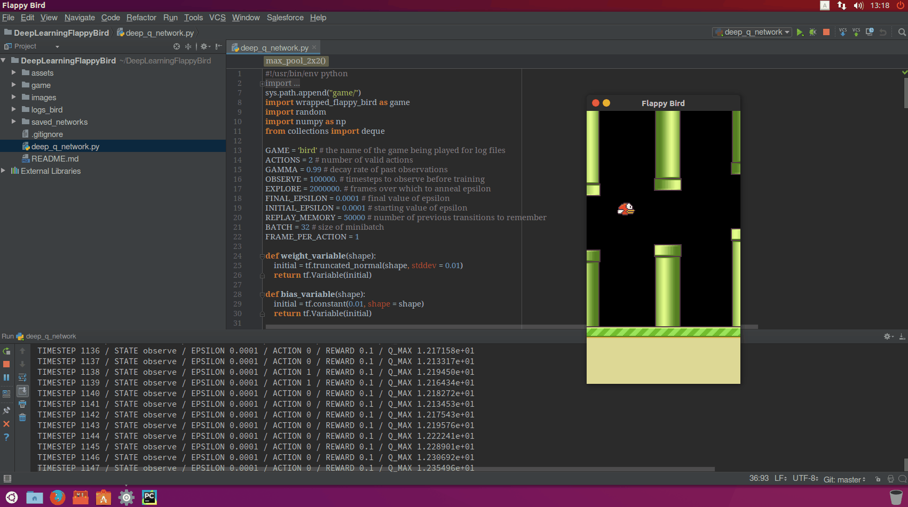
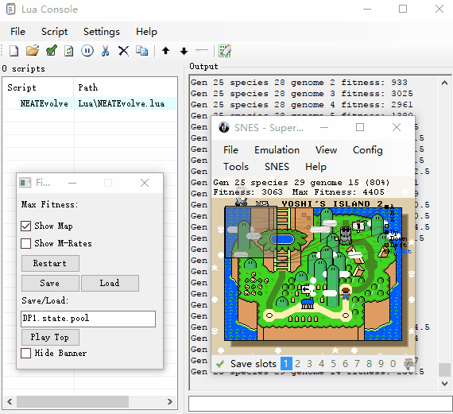
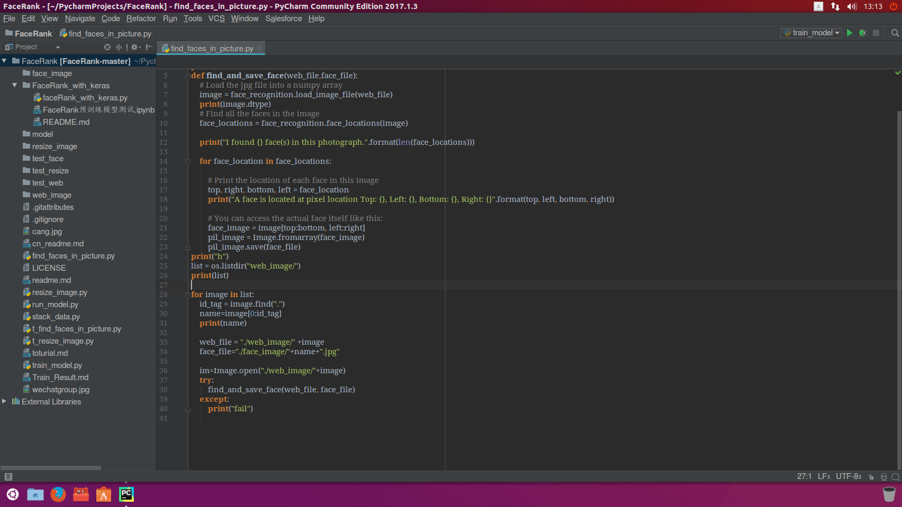

# 一些有趣的项目
收集的一些有趣的项目

[模拟器]

https://github.com/TASVideos/BizHawk

[FlapPyBird]

https://github.com/sourabhv/FlapPyBird

使用方法
-------

1. 安装 Python 2.7.X 或 3.5.x [Python官网](https://www.python.org/download/releases/)

2. 安装 PyGame 1.9.X [PyGame官网](http://www.pygame.org/download.shtml)

3. 获取代码: `git clone https://github.com/sourabhv/FlappyBirdClone.git`

4. 使用命令: `python flappy.py` 运行脚本

5. 按 <kbd>&uarr;</kbd> 键或 <kbd>Space</kbd> 键开始,使用按 <kbd>Esc</kbd> 键结束。

屏幕截图
-------

Ubuntu安装OpenCV2
-------
1. 获取代码: 

`wget https://github.com/opencv/opencv/archive/2.4.13.3.zip`

2. 解压: 

`unzip 2.4.13.3.zip`

3. 安装环境:

`sudo apt-get install build-essential`

`sudo apt-get install cmake git libgtk2.0-dev pkg-config libavcodec-dev libavformat-dev libswscale-dev`

`sudo apt-get install python-dev python-numpy libtbb2 libtbb-dev libjpeg-dev libpng-dev libtiff-dev libjasper-dev libdc1394-22-dev`

`cd ~/opencv-2.4.13.3`

`mkdir release`

`cd release`

4. 编译安装:

`cmake -D CMAKE_BUILD_TYPE=RELEASE -D CMAKE_INSTALL_PREFIX=/usr/local ..`

`sudo make`

`sudo make install`

安装pygame
-------
通过pip安装: 

`pip install pygame`