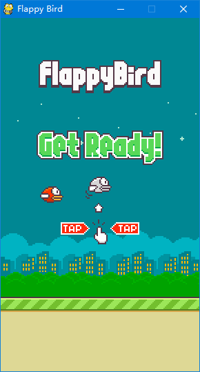
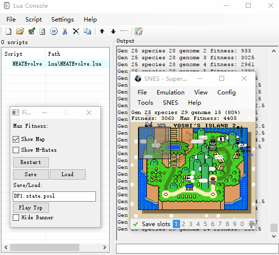

# interesting
一些有趣的项目

# 资源下载
# 相关链接
[模拟器]

https://github.com/TASVideos/BizHawk

[FlapPyBird]

https://github.com/sourabhv/FlapPyBird

A Flappy Bird Clone made using [python-pygame][1]

使用方法
-------

1. 安装 Python 2.7.X 或 3.5.x [Python官网](https://www.python.org/download/releases/)

2. 安装 PyGame 1.9.X [PyGame官网](http://www.pygame.org/download.shtml)

3. 获取代码: `git clone https://github.com/sourabhv/FlappyBirdClone.git`

4. 使用命令: `python flappy.py` 运行脚本

5. 使用 <kbd>&uarr;</kbd> 或 <kbd>Space</kbd> key 开始,使用 <kbd>Esc</kbd> 结束。

(备注: Install pyGame for same version python as above)

屏幕截图
-------

[1]: http://www.pygame.org

